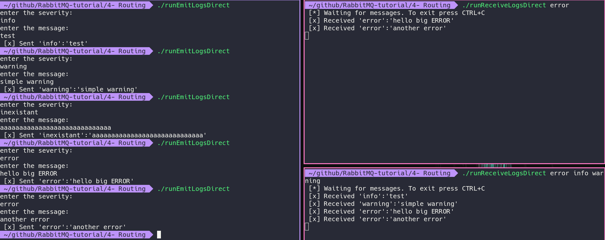

# setup intellij 
goto file -> project structure -> modules -> dependencies  
and add the ./lib folder as a dependency

# compile

```
./compile
```

# run

rabbitmq server must be running with user bechir and password bechir

## Worker

```
./runReceiveLogsDirect
```

## NewTask

```
./runEmitLogsDirect
```

# Execution
messages are routed by their severity


# resources
https://www.rabbitmq.com/tutorials/tutorial-four-java.html  
https://www.rabbitmq.com/tutorials/tutorial-three-java.html  
https://www.rabbitmq.com/tutorials/tutorial-two-java.html  
https://www.rabbitmq.com/tutorials/tutorial-one-java.html  
https://www.rabbitmq.com/api-guide.html

